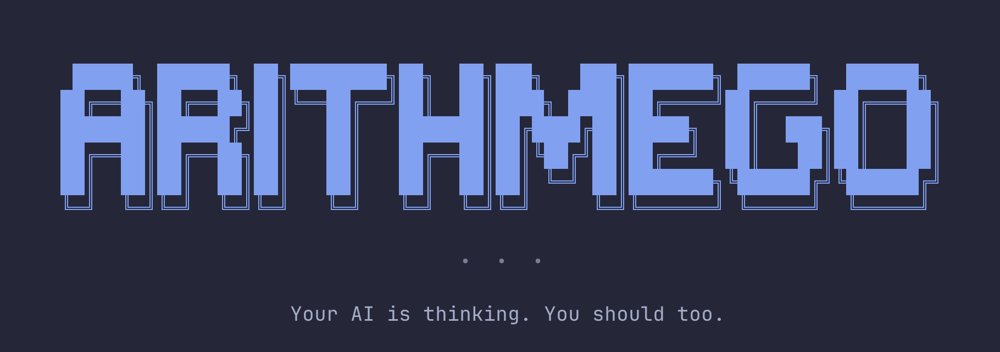

<div align="center">



[](https://github.com/gurselcakar/arithmego/actions)
[](https://github.com/gurselcakar/arithmego/releases)
[](LICENSE)

</div>

## Install

```bash
curl -fsSL https://arithmego.com/install.sh | bash
```

## What is this?

A terminal-based arithmetic game for developers.

- Multiple operations — add, subtract, multiply, and beyond
- Progressive difficulty — start easy, work your way up
- Diverse game modes — pick one operation or mix them all
- Quick Play — one command, your last settings, go
- Practice Mode — no timer, no pressure, just math
- Local statistics — see where you're improving
- Terminal-native — lives where you already work
- Cross-platform — macOS and Linux (Windows coming soon)

## Usage

```
arithmego            # Open main menu
arithmego play       # Quick play with last settings
arithmego statistics # View your stats
arithmego update     # Check for updates
```

## Development

Requires Go 1.25+.

```
make build    # Build for current platform
make run      # Build and run
make test     # Run tests
make lint     # Run linter
```

## Docs

- [Architecture](docs/ARCHITECTURE.md) — Tech stack and project structure
- [Website](docs/WEBSITE.md) — Hugo site structure and content editing

## License

MIT. See [LICENSE](LICENSE).
